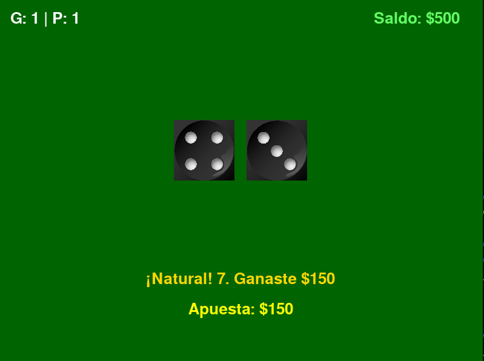

 # Casino Craps
Es un juego desarrollado con Pygame basado en el juego de casino Craps, el objetivo del juego es apostar y tirar los dados los cuales pueden dar los siguientes resultados:
- Si la suma de los dados da 7 o 11, consigues un número natural y ganas al instante
- Si la suma de los dados da 2, 3 o 12 consigues un número conocido como Crap y pierdes
- Si obtienes algún otro número que no sea de los anteriores, consigues un punto el cual debes de volver a obtener para poder ganar, si en el proceso de obtenerlo llega a tocarte un 7, pierde.

---

## Requisitos

Para poder ejecutar el juego requieres:
- Python 3.12.3 o posterior
- Pygame 2.6.0 o posterior

---

## Controles

Los controles son muy sencillos, primero, para poder apostar, necesitas mover las flechas arriba y abajo para ajustar la apuesta, siendo de $10 en $10 el ajuste.
Para poder tirar los dados se utiliza space
Para salir del juego se debe de pulsar el botón de Escape

---

## Características

El juego tiene dos características a tomar en cuenta, la primera es que el juego tiene un contador de partidas ganadas y partidas perdidas, la segunda es que al inicio empiezas con $500, si llegas a perder todo tu dinero el juego te indica que estás en bancarrota, pero te rellena tu cuenta con otros $500 para que puedas seguir jugando.

---

## Imagen del juego

