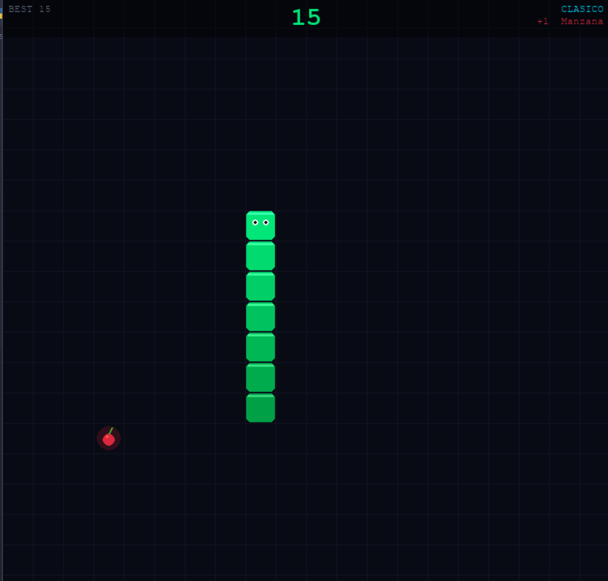

# Snake - Pystation



## Descripción del proyecto
Snake es una versión moderna y expandida del clásico juego Snake, desarrollada en Python utilizando la librería Pygame.

El proyecto no solo implementa la mecánica tradicional, sino que añade múltiples modos de juego, skins personalizables, sistema de frutas con diferentes efectos y un motor de sonido procedural que genera efectos y música dinámicamente.

El objetivo principal es controlar la serpiente, consumir frutas para crecer y acumular puntos, evitando colisiones según las reglas del modo seleccionado.


## Lógica y reglas del juego

### Modos de juego
El juego incluye múltiples modos que modifican la experiencia:

1. Clásico: Incremento progresivo de velocidad, colisionar con muros termina la partida.
2. Portal: La serpiente atraviesa paredes y aparece del lado opuesto.
3. Contrarreloj: Tiempo limitado (60 segundos) para maximizar el puntaje.
4. Caos: Las frutas cambian de posición automáticamente cada cierto tiempo.
5. Obstáculos: Se agregan bloques al mapa que dificultan el movimiento.

### Sistema de frutas
Cada fruta tiene propiedades únicas:

* Manzana: Balance estándar.
* Uva: Mayor puntuación, menor duración.
* Sandía: Más puntos, pero aparece con menor frecuencia.
* Estrella: Alta recompensa, muy rara.

Cada fruta define:

* Puntaje otorgado
* Tiempo de aparición
* Frecuencia

## Mecánicas del juego
1. Movimiento
   * La serpiente se mueve en una cuadrícula.
   * El jugador controla la dirección.
2. Crecimiento
   * Comer frutas incrementa el tamaño.
   * Aumenta la dificultad progresivamente.
3. Colisiones
    * Contra sí misma → derrota.
    * Contra muros → depende del modo.
4. Sistema de Puntuación
    * Basado en tipo de fruta y modo de juego.


## Como ejecutar el proyecto
### 1. Clonar el repositorio

```bash
git clone https://github.com/ErickDarkFire/Pystation.git
cd Pystation
cd snake
```

### 2. Instalar las dependencias

```bash
pip install pygame numpy
```

### 3. Ejecutar el juego

```bash
python snake.py
```

## Estrategia de pruebas

### 1. Pruebas unitarias (`tests/`)

Validan el comportamiento aislado de cada funcion y clase de los tres modulos. Se usa `unittest` como framework principal.

**Que se valida:**
- Funciones puras: `snap_to_grid`, `lerp_color`, `rainbow_color`, `random_pos`.
- Enum `Direction`: valores, opuestos, conversion a pixeles.
- Enum `Screen`: presencia de todos los estados requeridos.
- Clase `Fruit`: spawn, animacion, atributos de tipo y puntos.
- Clase `Obstacle`: construccion, deteccion de colision, centros.
- Funcion `make_obstacles`: generacion de centros, tipos de datos.
- Clase `Snake`: direccion, movimiento, colisiones, crecimiento.
- Clase `ScoreBoard`: puntaje, high score, historial.
- Clase `Button`: hit-testing.
- Constantes globales: `WINDOW`, `TILE_SIZE`, `RANGE`, `SKINS`, `GAME_MODES`.
- Funciones UI: `overlay`, `ctext`, `draw_grid`, `draw_hud`, `draw_playing`, `draw_dead`, `draw_main_menu`, `draw_mode_select`, `draw_customize`.
- `SoundManager` y `get_sound_manager`: estado inicial, toggles, play, set_music_level.
- Funciones de sintesis de audio: `_make_tone`, `_make_chord`, `_make_noise_burst`.

### 2. Pruebas de integracion (`integration_tests/`)

Validan la interaccion entre componentes del juego sin requerir una pantalla activa. Usa `unittest` con el modo `headless=True` de `Game`.

**Que se valida:**
- Inicializacion correcta del juego (pantalla, entidades, contadores).
- Transiciones de pantalla: menu principal, jugando, pausado, muerto.
- Manejo de teclas en distintos estados (ESC, P, RETURN, SPACE, WASD/flechas).
- Movimiento de la serpiente: avance segun intervalo, inmobilidad antes del intervalo.
- Colision serpiente + obstaculo: muerte y ausencia de colision.
- Sincronizacion ScoreBoard + Snake al comer frutas y crecer.
- Velocidad incremental con el puntaje.
- Modo Obstaculos: creacion de instancia Obstacle.
- Modo Contrarreloj: reduccion del countdown y transicion a DEAD.
- Modo Caos: reposicionamiento de fruta por timer.
- Modo Portal: wrapping de la serpiente en bordes y deteccion correcta.
- Ciclo update incrementa frame_count.

### 3. Pruebas de sistema (`system_tests/`)

Simulan interaccion real del usuario usando BDD + PydirectInput para enviar entradas de teclado.

**Que se valida:**
- El juego inicia en el menu principal.
- Inicio de partida con RETURN y SPACE.
- Movimiento de la serpiente con teclas UP, DOWN, LEFT, RIGHT, WASD.
- Pausa y reanudacion con tecla P.
- Vuelta al menu con ESC desde distintas pantallas.
- Seleccion de modos de juego con clic.
- Seleccion de skins con clic.
- Acumulacion de puntaje y crecimiento de la serpiente al comer una fruta.

---

## Herramientas utilizadas

| Herramienta | Proposito |
|---|---|
| `unittest` | Framework de pruebas unitarias e integracion |
| `coverage.py` | Medicion de cobertura de codigo |
| `behave` | Framework BDD para pruebas de sistema |
| `PydirectInput` | Simulacion de teclado y mouse en pruebas de sistema |
| `GitHub Actions` | CI/CD: lint en PRs y cobertura en push/merge |

---

## Organizacion de la suite de pruebas

```
snake_py/
├── snake.py
├── game_ui.py
├── sound_manager.py
├── tests/
│   ├── __init__.py
│   ├── test_snake_game.py
│   ├── test_game_ui.py
│   └── test_sound_manager.py
│
├── integration_tests/
│   ├── __init__.py
│   └── test_integration.py
├── system_tests/
│   └── features/
│       ├── environment.py
│       ├── menu_navigation.feature
│       ├── pause_resume.feature
│       ├── snake_movement.feature
│       └── steps/
│           └── snake_steps.py
├── .github/
│   └── workflows/
│       ├── lint.yml
│       └── coverage.yml
├── .flake8
├── .coveragerc
├── .pre-commit-config.yaml
└── setup.cfg
```

---

## Instrucciones de ejecucion

### Requisitos previos

```bash
pip install pygame numpy coverage flake8 behave pydirectinput
```

### Pruebas unitarias

```bash
  python -m unittest discover -s tests -p "test_*.py" -v
```

O por archivo individual:

```bash
python -m unittest tests.test_snake_game -v
python -m unittest tests.test_game_ui -v
python -m unittest tests.test_sound_manager -v
```

### Pruebas de integracion

```bash
  python -m unittest discover -s integration_tests -p "test_*.py" -v
```

### Pruebas de sistema (BDD)

```bash
  python -m behave system_tests/features
```

### Cobertura de codigo

Ejecutar pruebas acumulando cobertura:

```bash
SDL_VIDEODRIVER=dummy SDL_AUDIODRIVER=dummy \
  coverage run --source=snake,game_ui,sound_manager \
  -m unittest discover -s tests -p "test_*.py"

SDL_VIDEODRIVER=dummy SDL_AUDIODRIVER=dummy \
  coverage run --append --source=snake,game_ui,sound_manager \
  -m unittest discover -s integration_tests -p "test_*.py"

coverage report --show-missing
coverage html
```

---

## GitHub Actions — Workflows

### `lint.yml` — Se ejecuta en cada Pull Request

Se activa automaticamente cuando se abre o actualiza un Pull Request hacia `main` o `develop`. Instala flake8 y ejecuta el linter sobre los modulos del juego y la suite de pruebas. El PR no puede mergearse si el linter reporta errores.

```
Pull Request -> Checkout -> Setup Python -> Install flake8 -> Run flake8
```
